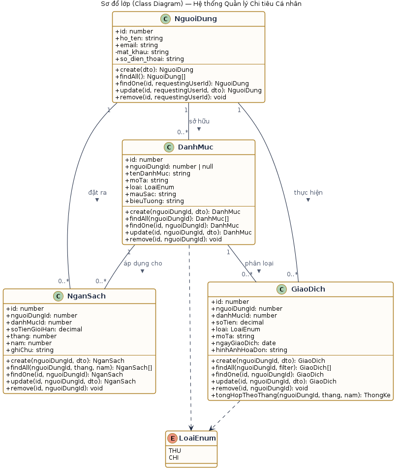
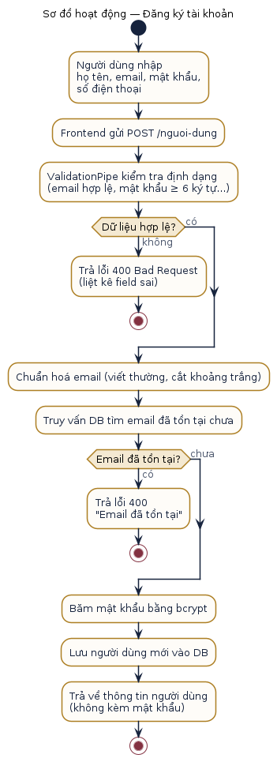
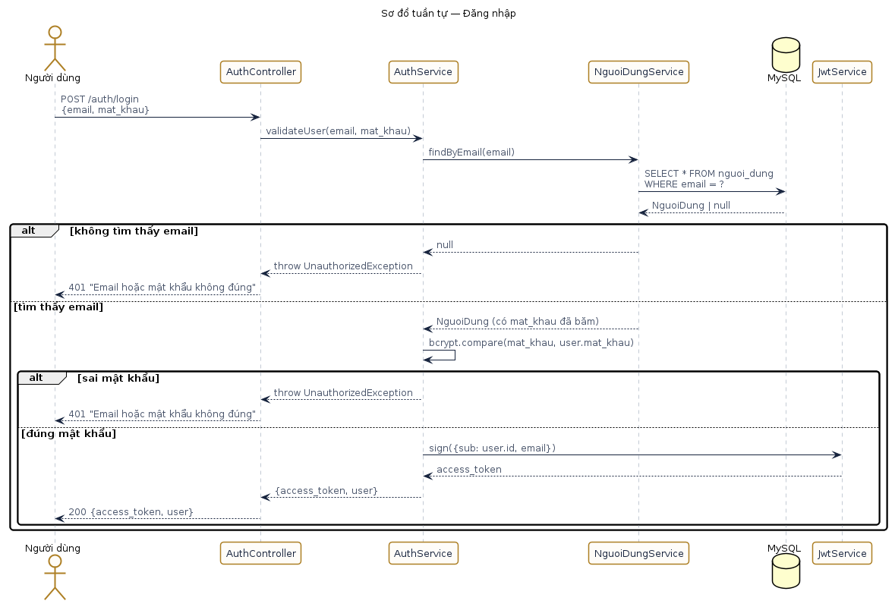
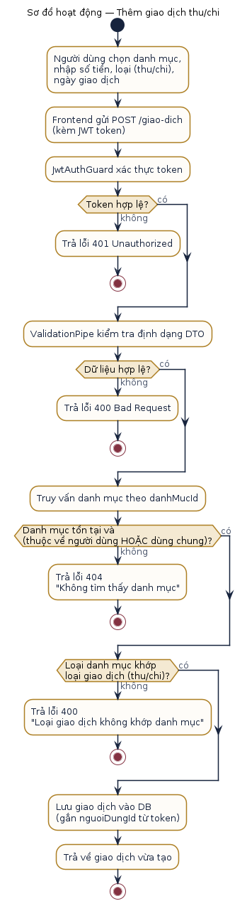
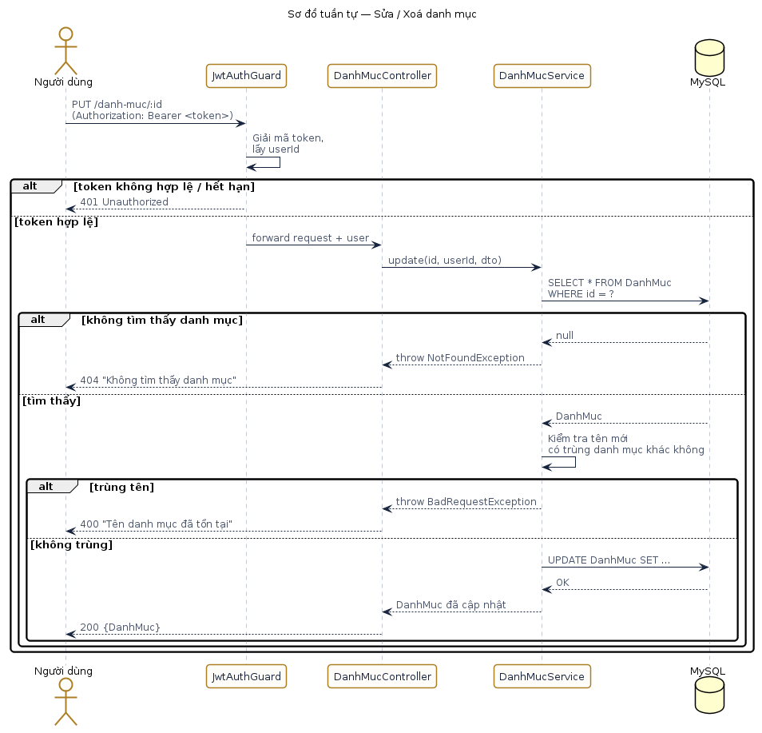
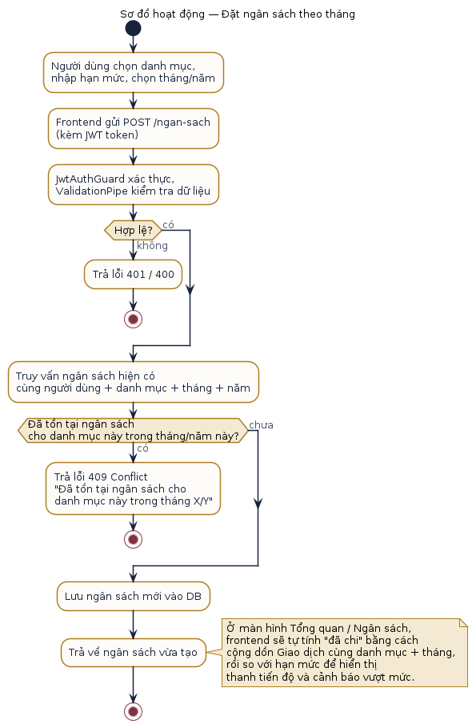

# Câu 3 — Sơ đồ UML

Toàn bộ sơ đồ được vẽ bằng PlantUML (mã nguồn `.puml` đi kèm mỗi ảnh `.png` trong thư mục `diagrams/`, có thể chỉnh sửa và render lại bằng lệnh `plantuml -tpng ten-file.puml`).

## 3.1. Sơ đồ cấu trúc lớp (Class Diagram)

Sơ đồ thể hiện đầy đủ 4 lớp đối tượng (NguoiDung, DanhMuc, GiaoDich, NganSach), thuộc tính, phương thức, và các quan hệ liên kết đã phân tích ở Câu 2.

## 3.2. Sơ đồ hoạt động / tuần tự (ít nhất 5 sơ đồ)

### Sơ đồ 1 — Đăng ký tài khoản (Activity Diagram)

### Sơ đồ 2 — Đăng nhập (Sequence Diagram)

### Sơ đồ 3 — Thêm giao dịch thu/chi (Activity Diagram)

Thể hiện đầy đủ các bước kiểm tra: xác thực JWT, validate dữ liệu, kiểm tra danh mục tồn tại + đúng chủ, kiểm tra loại giao dịch khớp loại danh mục.

### Sơ đồ 4 — Sửa / Xoá danh mục (Sequence Diagram)

Thể hiện luồng xác thực JWT lấy userId, và kiểm tra trùng tên khi cập nhật.

### Sơ đồ 5 — Đặt ngân sách theo tháng (Activity Diagram)

Thể hiện bước kiểm tra trùng lặp ngân sách theo danh mục + tháng + năm trước khi lưu.
